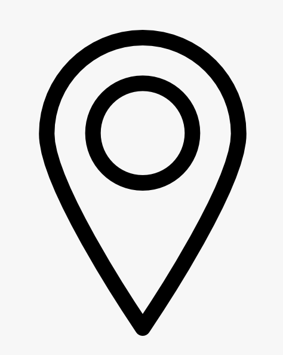

  

  
  Your City, Country

# Your Name

Write your ~200 word bio here. Talk about what you do, what you study/work on, your interests, and your goals. This text will appear to the right of your photo, just like the Joshimridul layout.

## Education

**Degree Name**  
University Name, Year  

**Previous Degree**  
Institution, Year  

## Interests

- Interest 1  
- Interest 2  
- Interest 3  
- Interest 4  

